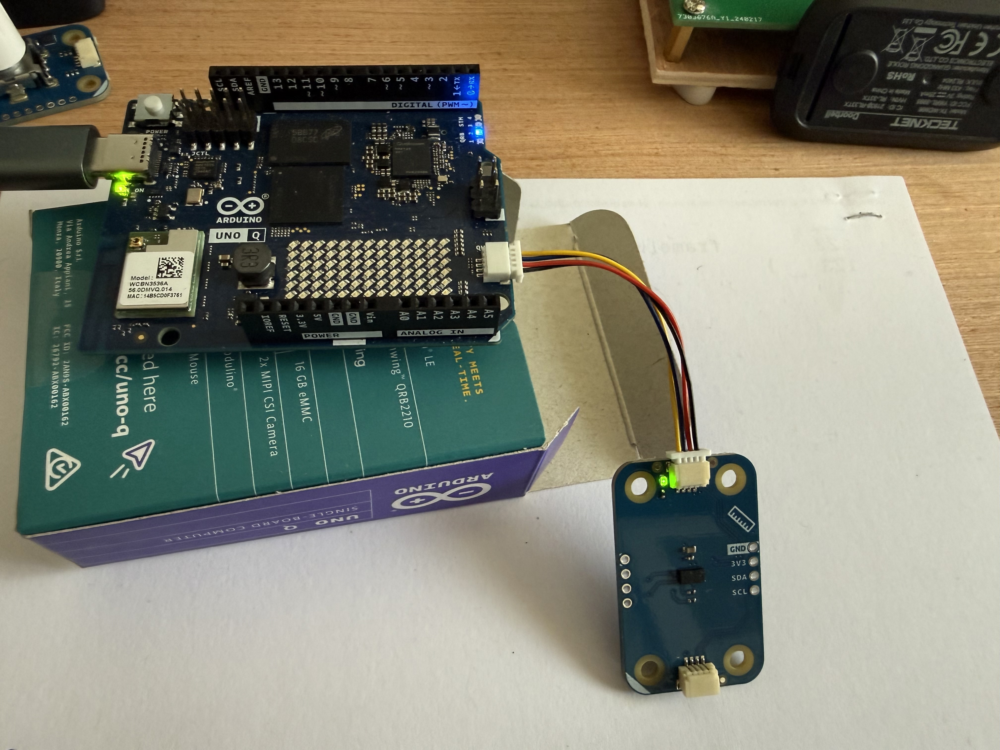

# Arduino UNO Q – Détecteur de présence avec Modulino Distance et notification iPhone (IFTTT)

Ce projet montre comment utiliser **l’Arduino UNO Q** pour créer un **détecteur de présence** basé sur le **Modulino Distance**, avec envoi d’une **notification sur iPhone** via **IFTTT**.

Il met en œuvre une architecture complète et réaliste :
- lecture capteur temps réel sur le **STM32**
- communication **STM32 → Linux** via `Arduino_RouterBridge`
- envoi HTTPS depuis le cœur Linux (Python)
- notification push sur iOS via IFTTT

---

## ✨ Fonctionnalités

- Détection de présence par distance (seuil configurable)
- Anti-rebond / limitation de notifications (cooldown)
- Communication STM32 ↔ Linux validée
- Notification instantanée sur iPhone
- Architecture conforme à la philosophie de l’UNO Q

---

## 🧠 Architecture générale

```
Modulino Distance
↓
STM32 (Arduino)
↓ Bridge.call()
Cœur Linux (Python)
↓ Webhook HTTPS
IFTTT
↓
Notification iPhone
```

---

## 🔧 Matériel utilisé

- Arduino **UNO Q**
- **Modulino Distance**
- iPhone avec application IFTTT installée

---

## 📦 Dépendances

### Côté STM32 (Arduino)
- Arduino_Modulino et ses dépendances
- Arduino_RouterBridge

### Côté Linux (App Lab / Python)
- arduino.app_utils
- urllib / json (standard Python)

---

## 🚀 1. Code STM32 (Arduino)

```cpp
// code C++


#include <Arduino.h>
#include <Arduino_RouterBridge.h>
#include <Arduino_Modulino.h>

ModulinoDistance distance;

const int SEUIL_MM = 800;                 // présence si distance < 80 cm
const unsigned long COOLDOWN_MS = 10000;  // 1 notification max toutes les 10 s
unsigned long lastSendMs = 0;

void setup() {
  Bridge.begin();
  Modulino.begin();
  distance.begin();

  // Laisse le temps au script Python de s'initialiser
  delay(5000);
}

void loop() {
  if (distance.available()) {
    int mm = distance.get();
    bool presence = (mm > 0 && mm < SEUIL_MM);

    unsigned long now = millis();
    if (presence && (now - lastSendMs >= COOLDOWN_MS)) {
      lastSendMs = now;
      Bridge.call("presence_mm", mm);
    }
  }
  delay(20);
}
```
---

## 🐍 Code Python (Linux / App Lab)  
⚠️ Important : remplacez l’URL IFTTT par la vôtre.

```python

# code Python


import time
import json
import datetime
import urllib.request
from arduino.app_utils import App, Bridge

print("Python ready", flush=True)

IFTTT_URL = "https://maker.ifttt.com/trigger/uno-q-presence/with/key/VOTRE_CLE_IFTTT"

def presence_mm(mm: int):
    print("Presence detectee, mm =", mm, flush=True)

    payload = {
        "value1": "distance_mm=" + str(mm),
        "value2": datetime.datetime.now().strftime("%Y-%m-%d %H:%M:%S"),
        "value3": "UNO Q"
    }

    data = json.dumps(payload).encode("utf-8")

    req = urllib.request.Request(
        IFTTT_URL,
        data=data,
        headers={"Content-Type": "application/json"},
        method="POST"
    )

    with urllib.request.urlopen(req, timeout=10) as r:
        print("IFTTT status:", r.status, flush=True)

    return True

Bridge.provide("presence_mm", presence_mm)

def loop():
    time.sleep(1)

App.run(user_loop=loop)
```

---

# Principe du JSON et de la requête HTTP vers IFTTT

Dans ce projet, le cœur Linux de l’Arduino UNO Q envoie une notification vers IFTTT en utilisant une requête HTTP **POST** contenant des données au format **JSON**.

L’objectif est de transmettre des informations (distance, date/heure, source) à un service cloud (IFTTT), qui déclenche ensuite une action (notification iPhone, mail, etc.).

---

## 1. Pourquoi utiliser du JSON

JSON (JavaScript Object Notation) est un format texte standard pour échanger des données entre machines.

Avantages :
- lisible par un humain
- simple à générer
- indépendant du langage (Python, C, JavaScript, etc.)
- très répandu dans les API web (dont IFTTT)

JSON est une structure de paires **clé / valeur**.

---

## 2. Exemple simple de JSON

Exemple de message envoyé à IFTTT :

```json
{
  "value1": "distance_mm=742",
  "value2": "2025-12-16 11:13:22",
  "value3": "UNO Q"
}
```

---

## 3. Le rôle de IFTTT et des Webhooks

IFTTT propose un service appelé **Webhooks** qui permet de déclencher une action à partir d’une requête HTTP.

Le webhook attend typiquement :
- une requête HTTP **POST**
- envoyée vers une **URL spécifique**
- avec éventuellement un corps JSON

---

## 4. Format de l’URL Webhook IFTTT

Format général :

```text
https://maker.ifttt.com/trigger/NOM_EVENEMENT/with/key/CLE_SECRETE
```

- `NOM_EVENEMENT` : le nom de votre événement IFTTT (celui choisi dans l’applet)
- `CLE_SECRETE` : votre clé Webhooks personnelle (à garder privée)

---

## 5. Le rôle de value1, value2, value3

IFTTT Webhooks accepte jusqu’à trois champs personnalisés :

- `value1`
- `value2`
- `value3`

Ils servent à transporter des informations associées à l’événement. Dans ce projet, par exemple :
- `value1` : distance mesurée (ex. `"742 mm"`)
- `value2` : date/heure (ex. `"2025-12-16 11:13:22"`)
- `value3` : source (ex. `"UNO Q"`)

Dans IFTTT, ces champs sont réutilisables dans les actions via :
- `{{Value1}}`
- `{{Value2}}`
- `{{Value3}}`

---

## 6. Construction du JSON côté Python

En Python, on prépare d’abord un dictionnaire (structure clé/valeur) :

```python
payload = {
    "value1": "distance_mm=" + str(mm),
    "value2": datetime.datetime.now().strftime("%Y-%m-%d %H:%M:%S"),
    "value3": "UNO Q"
}
```

Puis on le convertit en JSON :

```python
data = json.dumps(payload).encode("utf-8")
```

- `json.dumps(...)` transforme le dictionnaire en texte JSON
- `.encode("utf-8")` transforme ce texte en octets (format attendu par HTTP)

---

## 7. Envoi de la requête HTTP POST

On envoie ensuite la requête HTTP POST avec :
- l’URL Webhooks IFTTT
- un header `Content-Type: application/json`
- le corps JSON (les octets `data`)

Exemple (simplifié) :

```python
req = urllib.request.Request(
    IFTTT_URL,
    data=data,
    headers={"Content-Type": "application/json"},
    method="POST"
)

with urllib.request.urlopen(req, timeout=10) as r:
    print("IFTTT status:", r.status)
```

Si tout est correctement configuré, IFTTT répond généralement avec un code HTTP **200**.

---

## 8. Chaîne complète de fonctionnement

1. Le STM32 détecte une présence via le capteur de distance
2. Le STM32 envoie l’événement au cœur Linux avec `Bridge.call("presence_mm", mm)`
3. Le script Python reçoit l’événement via `Bridge.provide("presence_mm", ...)`
4. Python construit un JSON avec `value1`, `value2`, `value3`
5. Python envoie un HTTP POST au Webhook IFTTT
6. IFTTT déclenche l’applet
7. L’iPhone reçoit la notification

---

## Remarque importante sur la sécurité

Ne publiez pas votre **clé Webhooks** dans un dépôt public.  
Si une clé a été exposée, régénérez-la dans IFTTT puis mettez à jour l’URL.


## 📱 Résultat attendu
Lorsqu’une présence est détectée à moins de 80 cm : 
- le STM32 envoie l’événement
- le cœur Linux déclenche le webhook
- **une notification apparaît sur l’iPhone**

## Aperçu : 



---

## 🔒 Sécurité
Ne publiez jamais votre clé IFTTT en clair sur un dépôt public.
Pensez à la régénérer avant toute mise en ligne définitive.

## 🧩 À propos
Ce projet montre une utilisation avancée et réaliste de l’UNO Q, en respectant la séparation des rôles :
STM32 : capteurs, temps réel
Linux : réseau, HTTPS, services cloud

##  🙏 Remerciements
Ce projet a été développé avec l’aide de ChatGPT, pour l’architecture,   
le débogage et la mise en œuvre complète de la communication STM32 ↔ Linux.

